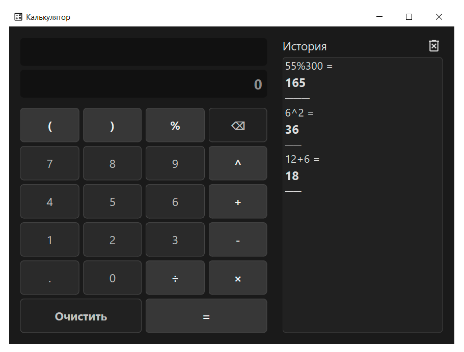

# 📌 Калькулятор

  
_Современное приложение-калькулятор с расширенными функциями._

---

## 🔍 Описание

**Калькулятор** — это приложение для вычислений с удобным графическим интерфейсом, разработанное с использованием PyQt6.  
Ключевые особенности:  
- 🚀 Удобный интерфейс с историей вычислений  
- 🔒 Поддержка сложных выражений (%, возведение в степень и др.)  
- 🎨 Визуальное оформление с использованием кастомных стилей  

---

## 🛠️ Установка и запуск

### Требования
- Python версии 3.10 или выше
- Установленные зависимости (см. `requirements.txt`)

### Инструкция по установке
1. Склонируйте репозиторий:
    ```bash
    git clone https://github.com/akilary/Calculator.git
    ```
2. Установите зависимости:
    ```bash
    pip install -r requirements.txt
    ```
3. Запустите проект:
    ```bash
    python main.py
    ```

---

## ⚙️ Основной функционал

- **Калькулятор**: поддержка базовых и сложных операций  
- **История вычислений**: сохранение и управление выполненными вычислениями  
- **Обработка ошибок**: корректные сообщения при делении на ноль или синтаксических ошибках  


---

## 🎨 Скриншоты



---

## 📚 Используемые технологии

- Язык: Python
- Библиотеки: PyQt6
- Дополнительно: JSON для хранения истории  

---

## 🛡️ Лицензия

Этот проект распространяется под лицензией GPL v3.0. Подробнее см. [LICENSE](LICENSE).

---

## 📧 Контакты для связи

- Автор: Akilary
- Email: a.akilary@gmail.com
- GitHub: https://github.com/akilary

---

## 🏗️ Планы на будущее

- 🧮 Добавление функции расчета факториала  
- 📦 Добавление кнопки для конвертации единиц (например, метры в километры, градусы Цельсия в Фаренгейты).  
- 🎨 Опция смены темы интерфейса (светлая и тёмная тема).  
- 🔢 Кнопка “π” и “e” для быстрого ввода математических констант.  

---

_Star this repo 🌟, если проект вам понравился!_
